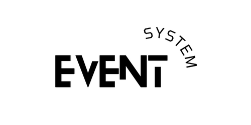

<h1>Projeto: “Sistema de Gestão de Eventos”</h1>
<h2>Atividade Avaliativa da Unidade Curricular de Programação Orientada a Objetos - IFSC Canoinhas/SC</h2>

Trata-se da 1ª Etapa do Projeto / Atividade Avaliativa desenvolvida para cumprir os requisitos da Unidade Curricular de Programação Orientada a Objetos do Instituto Federal de Educação, Ciência e Tecnologia de Santa Catarina - IFSC Câmpus Canoinhas/SC.

Professor: Dr. Fernando Roberto Pereira.

<h3>Logo do Projeto</h3>

 

<h3>Slogan do Projeto:</h3>

<i>“Para um melhor controle dos seus eventos”</i>

<h2>Descrição do Projeto</h2>

O Event System tem como objetivo auxiliar as instituições de ensino a fazerem a gerência de eventos acadêmicos (e.g., palestras, workshops, atividades de extensão, mostras e afins).

Cada evento possui diversas informações tais como:

 
 <ul type="disc">
  <li>Nome e Título</li>
  <li>Data de início e fim</li>
  <li>Carga-horária</li>
  <li>Organizadores</li>
  <li>Descrição e Categoria</li>
  <li>Local</li>
  <li>Horário de início e fim</li>
  <li>Limite de participantes</li>
  <li>Interessados</li> 
 </ul>
   

O proponente do evento informa os dados supracitados para cadastrar o evento no sistema.

Para a comunidade acadêmica cadastrar-se em um evento na condição de participante, é necessário informar qual papel desempenha no campus (docente ou discente).

Se discente deve informar:

  
  <ul type="disc">
   <li>Nome Completo</li>
   <li>Data de nascimento</li>
   <li>Número da matrícula</li>
   <li>CPF</li>
   <li>Curso</li>
   <li>Turno</li> 
  </ul>
    

Se docente deve informar:

 
  <ul type="disc">
   <li>Nome Completo</li>
   <li>Data de nascimento</li>
   <li>CPF</li>
   <li>Título</li>
   <li>Carga Horária</li>
   <li>Turno</li> 
   <li>Especialização</li>
   <li>Unidades Curriculares</li> 
  </ul>
 
   

De modo geral, quando ocorre um evento, na mesa de recepção do evento, o participante deve informar seu CPF para comprovar sua participação.

   

Para acompanhar o andamento dos eventos, o sistema é capaz de prover relatório que ranqueia os eventos com base no número de participantes, para um melhor gerenciamento e organização por parte dos organizadores.

### Funcionalidades da Aplicação:
* Cadastro de Evento;
* Cadastro de Participantes;
* Inscrição de Participantes nos Eventos;
* Registro de presença;
* Agenda de eventos;
* Busca de eventos por filtros característicos;
* Relatório.

<h3>Status do Projeto</h3>

<b>Em Andamento.</b>

O projeto está dividido em etapas de implementação. Nesta primeira etapa foram desenvolvidas somente algumas funcionalidades do sistema descritas acima, são elas:
* Cadastro de Evento
* Cadastro de Participante
* Visualização de Evento cadastrado
* Visualização de Participante cadastro

### Tecnologias utilizadas:
* Linguagem de programação: JAVA
* IDE: IntelliJ

### Pessoas Contribuidoras:
* DANIEL JOSÉ MARTINS JUNIOR
* LAISA KARINA DO NASCIMENTO
* LUIZ EDUARDO DO NASCIMENTO CIARALLO

### Pessoas Desenvolvedoras do Projeto:
* DANIEL JOSÉ MARTINS JUNIOR
* LAISA KARINA DO NASCIMENTO
* LUIZ EDUARDO DO NASCIMENTO CIARALLO
